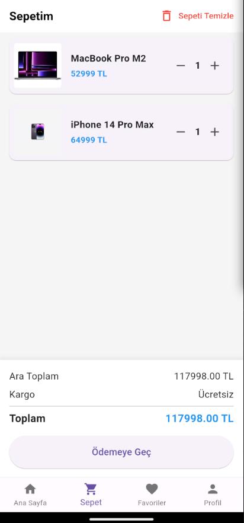
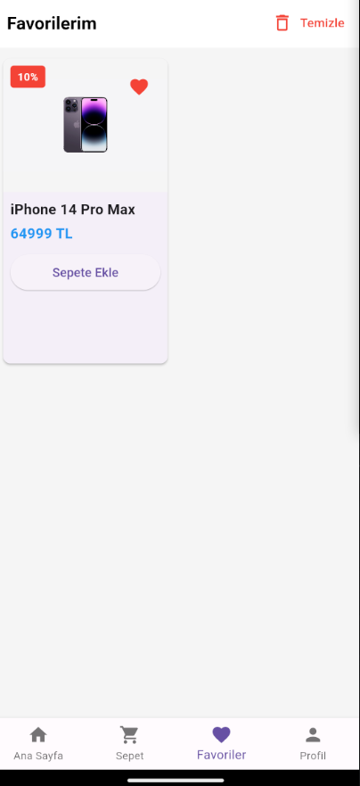
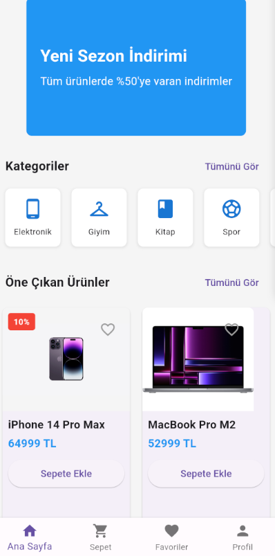
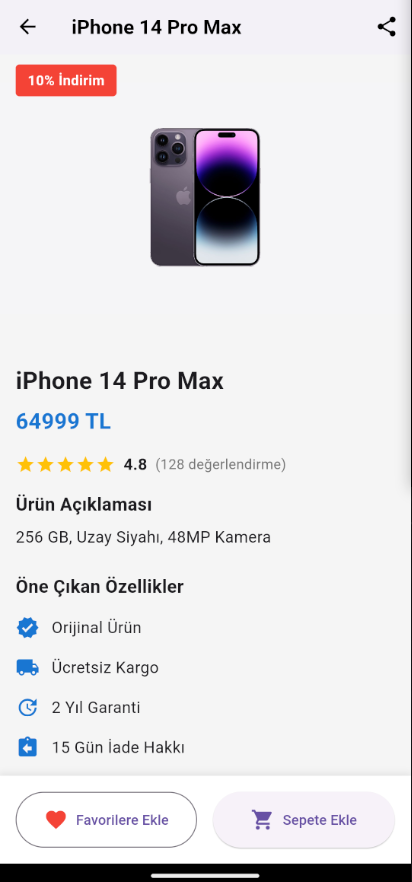
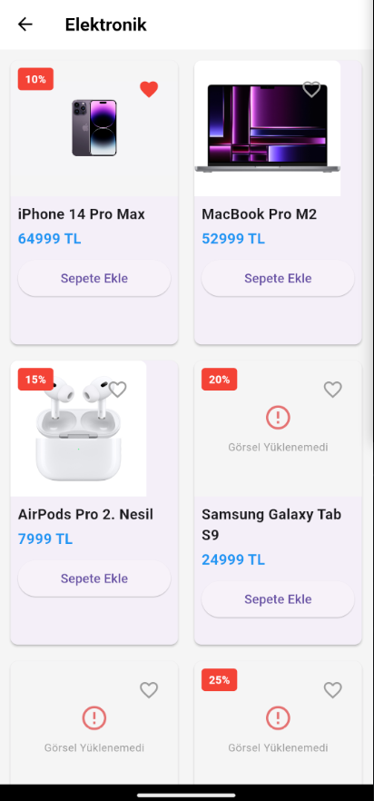

# 🛍️ E-Ticaret Uygulaması

Modern ve kullanıcı dostu bir e-ticaret deneyimi sunan Flutter tabanlı mobil uygulama.

## ✨ Özellikler

### 🏠 Ana Sayfa
- Dinamik ürün listesi
- Kategorilere göre filtreleme
- Gelişmiş arama fonksiyonu
- Öne çıkan ürünler
- Banner slider ile kampanyalar
- Pull-to-refresh özelliği

### 🛍️ Ürün Detayları
- Yüksek kaliteli ürün görselleri
- Detaylı ürün açıklamaları
- Fiyat ve indirim bilgileri
- Yıldızlı değerlendirme sistemi
- Kullanıcı yorumları
- Favorilere ekleme
- Sepete ekleme

### 🛒 Sepet
- Kolay ürün ekleme/çıkarma
- Miktar güncelleme
- Toplam tutar hesaplama
- Kargo ücreti hesaplama
- Sepeti temizleme
- Ödemeye geçiş

### ❤️ Favoriler
- Favori ürünleri listeleme
- Hızlı sepete ekleme
- Favorilerden çıkarma
- Liste görünümü

### 👤 Profil
- Kullanıcı bilgileri yönetimi
- Adres defteri
- Kayıtlı kartlar
- Sipariş geçmişi
- Bildirim ayarları

### 🔔 Bildirimler
- Gerçek zamanlı bildirimler
- Okundu/okunmadı durumu
- Bildirim kategorileri
- Bildirim yönetimi

### 💳 Ödeme
- Güvenli ödeme sistemi
- Çoklu ödeme seçenekleri
- Adres seçimi
- Kart kaydetme
- Sipariş özeti

## 🛠️ Teknik Özellikler

- **State Yönetimi**: Provider
- **Yerel Depolama**: SharedPreferences
- **Ağ İstekleri**: HTTP
- **Görsel Önbellek**: Cached Network Image
- **Animasyonlar**: Custom animations
- **UI Bileşenleri**: Material Design
- **Responsive Tasarım**: Tüm ekran boyutlarına uyumlu
- **Tema Desteği**: Açık/Koyu tema
- **Dil Desteği**: Çoklu dil desteği (TR/EN)

## 🚀 Kurulum

1. Flutter'ı yükleyin (https://flutter.dev/docs/get-started/install)
2. Projeyi klonlayın:
   ```bash
   git clone https://github.com/semihcamlibel/ecommerce_app.git
   ```
3. Proje dizinine gidin:
   ```bash
   cd ecommerce_app
   ```
4. Bağımlılıkları yükleyin:
   ```bash
   flutter pub get
   ```
5. Uygulamayı çalıştırın:
   ```bash
   flutter run
   ```

## 📦 Kullanılan Paketler

```yaml
dependencies:
  flutter:
    sdk: flutter
  provider: ^6.1.1
  http: ^1.1.0
  cached_network_image: ^3.3.0
  shared_preferences: ^2.2.2
  carousel_slider: ^4.2.1
  flutter_rating_bar: ^4.0.1
```

## 🤝 Katkıda Bulunma

1. Bu depoyu fork edin
2. Yeni bir branch oluşturun (`git checkout -b feature/yeniOzellik`)
3. Değişikliklerinizi commit edin (`git commit -am 'Yeni özellik: Açıklama'`)
4. Branch'inizi push edin (`git push origin feature/yeniOzellik`)
5. Pull Request oluşturun

## 📝 Yapılacaklar Listesi

- [ ] Backend entegrasyonu
- [ ] Kullanıcı kimlik doğrulama
- [ ] Push bildirimleri
- [ ] Ödeme gateway entegrasyonu
- [ ] Performans optimizasyonları
- [ ] Unit ve widget testleri
- [ ] CI/CD pipeline kurulumu

## 🐛 Hata Bildirimi

Bir hata bulduysanız veya bir öneriniz varsa, lütfen bir [issue](https://github.com/semihcamlibel/ecommerce_app/issues) açın.

## 📄 Lisans

Bu proje MIT lisansı altında lisanslanmıştır - Detaylar için [LICENSE](LICENSE) dosyasına bakın.

## 👨‍💻 Geliştirici

**Semih Çamlıbel**

- GitHub: [@semihcamlibel](https://github.com/semihcamlibel)
- LinkedIn: [Semih Çamlıbel](https://linkedin.com/in/semihcamlibel)

## 🙏 Teşekkürler

- Flutter ekibine
- Tüm katkıda bulunanlara
- Kullanılan paketlerin geliştiricilerine

## 📱 Ekran Görüntüleri

### Uygulama Görünümü
<div align="center">
  
  
  
</div>

<div align="center">
  
  
  
</div>

<div align="center">
  
  
  
</div>